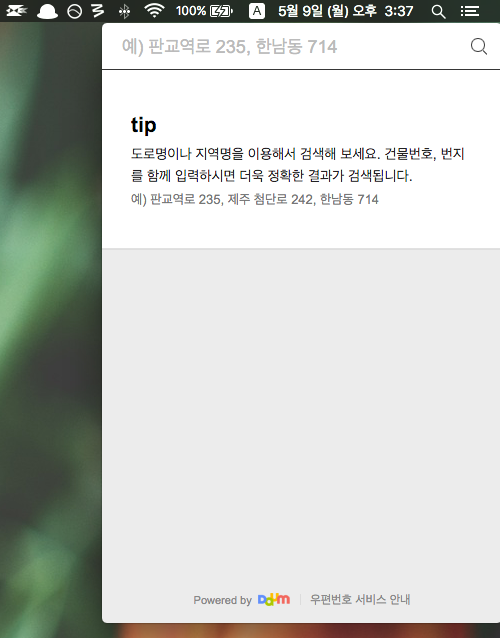

# DaumPostCodeBar [](http://standardjs.com/)
[Daum 우편번호 서비스](http://postcode.map.daum.net/guide)를 MenuBar에서 사용하자



## 설치
[Release 페이지](https://github.com/kyungw00k/DaumPostCodeBar/releases/)에서 내려 받아 사용하세요.

## 사용법
아이콘을 클릭하거나 `ctrl + shift + z`를 누르세요.

## 빌드
```sh
npm install && npm run build
```

## 참고
* [우정사업본부 > 디자인표준편람 링크](http://www.koreapost.go.kr/hongbo/postci/koreapost.html)</a>
* [maxogden/menubar](https://github.com/maxogden/menubar)

## License
MIT
